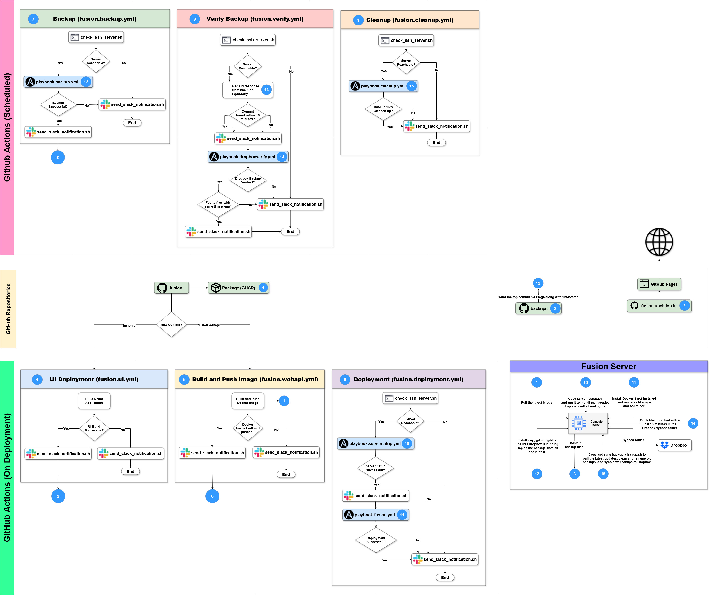

-  We are using the following GitHub Repositories: 
    1. **fusion**
        - **Actions:** We are using the following Actions:

            | Actions              | Purpose                                                                                           | How to trigger?                              |
            |:---------------------|:--------------------------------------------------------------------------------------------------|:---------------------------------------------|
            | fusion.ui.yml        | Builds React Application and send build files to github repository *fusion.upvision.in*.          | Commit in *fusion.ui/* directory             |
            | fusion.webapi.yml    | Build and Push the Docker image to GitHub Conatiner Registry (GHCR).                              | Commit in *fusion.webapi/* directory         |
            | fusion.deployment.yml| Execute ansible playbooks that setup the server and deploy the WebAPI application.                | Success of *fusion.webapi.yml* or Manually   |
            | fusion.backup.yml    | Execute ansible playbook that takes backups and sync them to the repository *backups* and Dropbox.| Scheduled daily at 7:00 AM (IST) or Manually |
            | fusion.verify.yml    | Verify that the recent backup files are present in github repository *backups* and Dropbox.       | Success of *fusion.backup.yml*               |
            | fusion.cleanup.yml   | Execute ansible playbook that renames and deletes the files.                                      | Scheduled daily at 7:15 AM (IST) or Manually |
        
        - **Ansible Playbooks:** We are using the following Playbooks:
            | Playbook                  | Purpose                                                                                                                                       | Executed By?         |
            |:--------------------------|:----------------------------------------------------------------------------------------------------------------------------------------------|:---------------------|
            | playbook.serversetup.yml  | Installs Manager.io, Dropbox, Nginx and Certbot if not already installed.                                                                     | fusion.deployment.yml|
            | playbook.fusion.yml       | Installs Docker, ensure */upvision.data/databases/fusion.data*, pull the latest image, run the container.                                     | fusion.deployment.yml|
            | playbook.backup.yml       | Install git, git-lfs, and zip, ensure required directories exist *(/upvision.data/ and ~/Dropbox/)*, backup and sync with GitHub and Dropbox. | fusion.backup.yml    |
            | playbook.dropboxverify.yml| Finds the files with defined time stamp in the Dropbox Synced directory *~/Dropbox/upvision.data*.                                            | fusion.verify.yml    |
            | playbook.cleanup.yml      | Cleanups the old backup files.                                                                                                                | fusion.cleanup.yml   |
